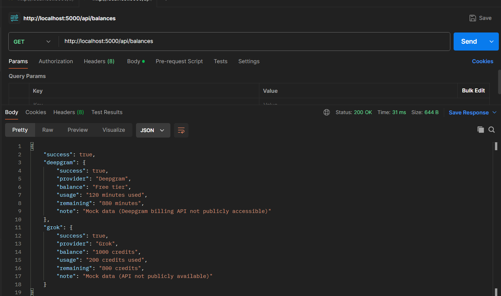

# 🚀 VocalFlow Backend Assignment

This project is a backend service built using Node.js and Express that provides API endpoints to fetch balance information for Deepgram and Grok.

---

## 📌 Features

* ✅ Deepgram balance (mock implementation)
* ✅ Grok balance (mock implementation)
* ✅ Clean MVC architecture (Controller, Service, Routes)
* ✅ Config-based API key management
* ✅ REST API endpoint

---

## 🧠 Tech Stack

* Node.js
* Express.js
* Axios
* Dotenv

---

## 📁 Folder Structure

```
vocalflow-backend/
│
├── config/
│   └── config.js        # API keys configuration
│
├── controllers/
│   └── balanceController.js   # Handles request & response
│
├── routes/
│   └── balanceRoutes.js       # API routes
│
├── services/
│   └── balanceService.js      # Business logic
│
├── app.js              # Main server file
├── package.json
├── .gitignore
├── README.md
```

---

## ⚙️ Setup Instructions

### 1️⃣ Clone the Repository

```
git clone https://github.com/your-username/vocalflow-backend.git
cd vocalflow-backend
```

---

### 2️⃣ Install Dependencies

```
npm install
```

---

### 3️⃣ Configure Environment Variables

Create a `.env` file in the root directory:

```
DEEPGRAM_API_KEY=your_deepgram_api_key
GROK_API_KEY=your_grok_api_key
```

---

### 4️⃣ Run the Server

```
npm start
```

👉 Server will run on:
http://localhost:5000

---

## 🔗 API Endpoint

### 👉 Get Balances

```
GET /api/balances
```

📌 Example:
http://localhost:5000/api/balances

---

## 📸 API Response Screenshot



---

## 📊 Sample Response

```json
{
  "success": true,
  "deepgram": {
    "success": true,
    "provider": "Deepgram",
    "balance": "Free tier",
    "usage": "120 minutes used",
    "remaining": "880 minutes"
  },
  "grok": {
    "success": true,
    "provider": "Grok",
    "balance": "1000 credits",
    "usage": "200 credits used",
    "remaining": "800 credits"
  }
}
```

---

## ⚠️ Notes

* Deepgram billing API is not publicly accessible for all users, so a mock response is used.
* Grok API is also not publicly available, so mock data is implemented.
* The system is designed in a scalable way to integrate real APIs in the future.

---

## 🎯 Key Highlights

* Clean and modular backend architecture
* Proper error handling
* Environment-based configuration
* Ready for production-level scaling

---

## 👨‍💻 Author

Sahil Chouhan
